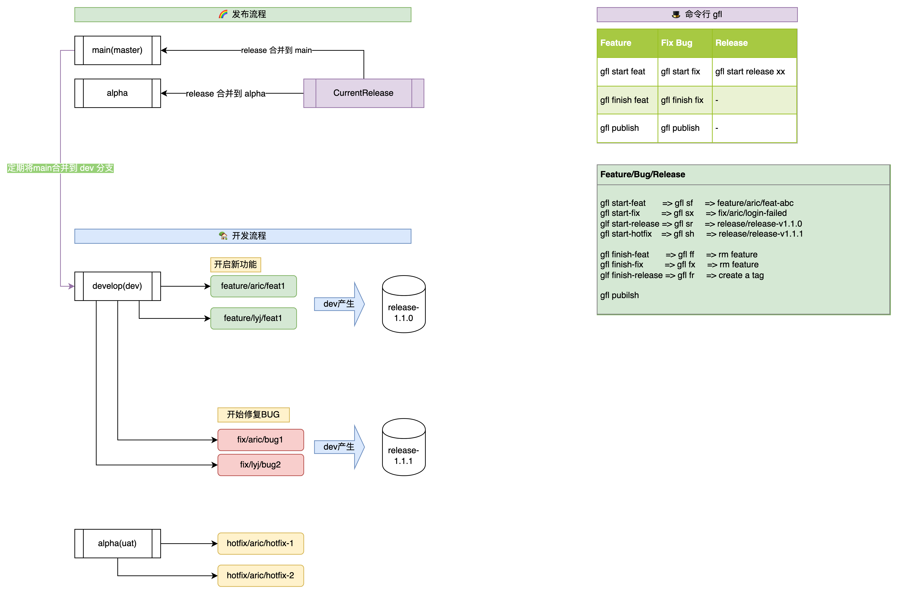

# github-flow
> Github/gitlab flow command line tool.



## actions
- [feature](docs/release.md)
- [bugfix](docs/bugfix.md)
- [hotfix](docs/hotfix.md)
- [release](docs/release.md)

## release
```shell
# update tag
nrcip
# release bin file
goreleaser release --clean
# upload dist to oss bucket
oss://web-alo7-com/assets/bins/gfl-releases/

# list oss
oss://web-alo7-com/assets/bins/gfl-releases/
# upload oss
cd dist && aliyun oss sync . oss://web-alo7-com/assets/bins/gfl-releases/ --delete --force
```

## usage
```bash
$ gfl -h
Github Flow CLI

Usage:
  github-flow [flags]
  github-flow [command]

Available Commands:
  checkout    交互式的git分支切换(alias: co)
  completion  Generate the autocompletion script for the specified shell
  help        Help about any command
  hotfix      开始一个hotfix分支
  init        初始化 Github Flow 配置
  pr          打开 GitHub 的 PR 页面
  publish     发布当前分支(alias: p)
  release     以最近 tag(eg:v1.0.0) 为基准，生成新的 release 版本
  start       开始一个新功能(alias: s)
  sweep       清理包含特定关键词的分支(alias: clean, rm)
  sync        同步远程仓库到本地仓库/更新所有远程仓库的引用
  tag         以最近 tag(eg:v1.0.0) 为基准，生成新的 tag 版本
  version     获取程序版本

Flags:
  -h, --help      help for github-flow
  -v, --version   show version

Use "github-flow [command] --help" for more information about a command.
```
